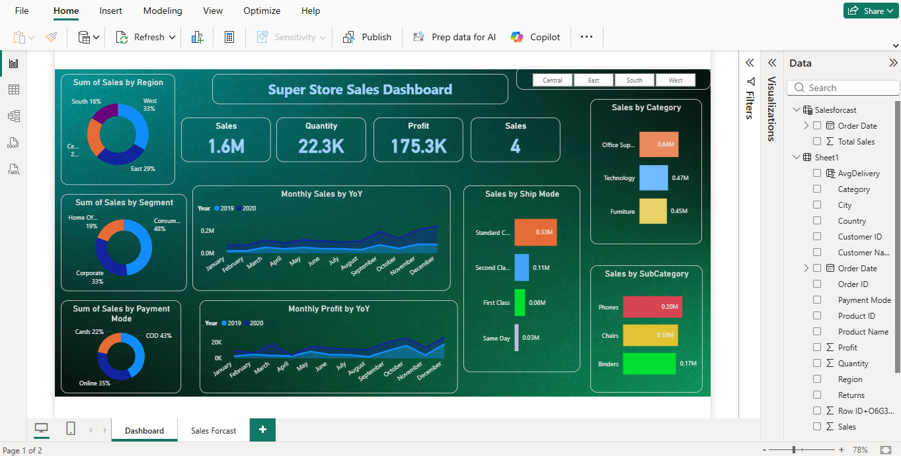

## Super Store Sales Dashboard

This project is an interactive Power BI dashboard created using the Super Store dataset. 
It analyzes sales performance, profit trends, customer segments, and regional sales to provide useful business insights.

## Dashboard Preview

## Features
- Sales analysis by region
- Sales by category and sub-category
- Monthly sales and profit trends
- Sales by ship mode
- Sales by customer segment

## Tools Used
- Power BI (#powerbi)
- Data Analysis (#data-analysis)
- Data Visualization (#data-visualization)
- Dashboard (#dashboard)
- Business Intelligence (#business-intelligence)
